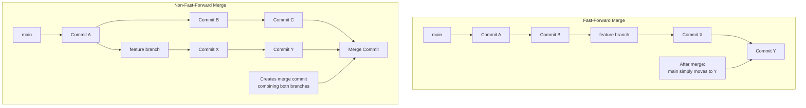
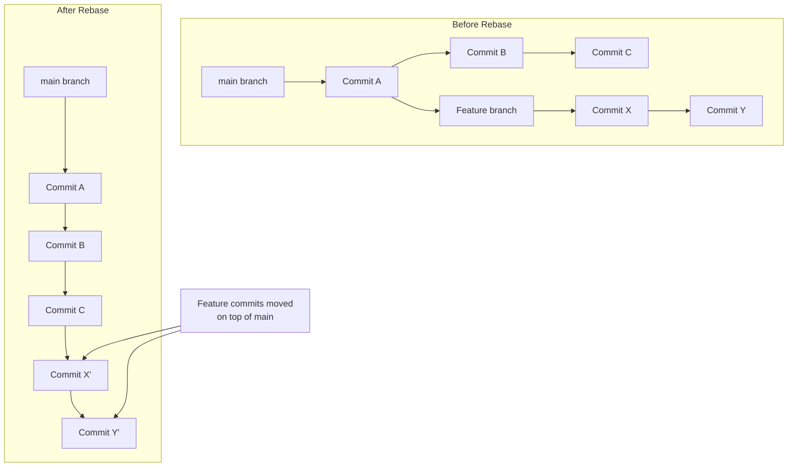

# Git Cheat Sheet

Git is a distributed version control system that tracks changes in files and coordinates work among multiple people.

## Initial Setup
Set your identity for commits:
```bash
$ git config --global user.name "Your Name"
$ git config --global user.email "your.email@example.com"
```

## Creating Repositories

### Start a New Local Repository
```bash
$ git init <directory>          # Create new repo in directory
$ git init                      # Initialize current directory as repo
```

### Clone an Existing Repository
```bash
$ git clone <url>               # Download remote repo to local machine
```

### Create Local Repo and Push to New Remote
```bash
$ git init                      # Initialize local repo
$ git add .                     # Stage all files
$ git commit -m "Initial commit"   # First commit
$ git branch -M main            # Rename branch to main
$ git remote add origin <url>   # Connect to remote repo
$ git push -u origin main      # Push and set upstream
```

## Basic Git Workflow

### File Status Lifecycle


**Four main states:**
- **Untracked:** File exists but Git doesn't track it
- **Unmodified:** File tracked, no changes since last commit  
- **Modified:** File tracked, has changes since last commit
- **Staged:** File marked to be included in next commit

### Adding and Committing Changes
```bash
$ git add <file>                # Stage specific file
$ git add .                     # Stage all files
$ git commit -m "message"       # Commit staged files
$ git commit -am "message"      # Stage tracked files and commit in one step
$ git commit --amend -m "new message"  # Modify last commit message/content
```

## Local Undo Changes

### Unstaging Files (Remove from Staging Area)
```bash
$ git restore --staged <file>   # Unstage file (preferred method)
$ git reset HEAD <file>         # Unstage file (older method)
```

### Discard Working Directory Changes
```bash
$ git restore <file>            # Discard changes to file
$ git checkout -- <file>       # Discard changes (older method)
$ git clean -f                  # Remove untracked files
$ git clean -fd                 # Remove untracked files and directories
```

### Undoing Commits with Reset
```bash
$ git reset --soft HEAD^       # Undo last commit, keep changes staged
$ git reset --mixed HEAD^      # Undo last commit, unstage changes (default)
$ git reset --hard HEAD^       # Undo last commit, discard all changes
$ git reset HEAD~2             # Go back 2 commits
```

**Reset Types:**
- **--soft:** Only removes commit record, keeps changes staged
- **--mixed:** Removes commit and unstages changes, keeps working directory
- **--hard:** Removes commit, staging, and working directory changes completely

## Remote Undo Changes

### Safe Undo for Shared Repositories
```bash
$ git revert <commit_id>        # Create new commit that undoes specified commit
$ git revert HEAD               # Undo last commit safely
```

## Branches

### Basic Branch Operations
```bash
$ git branch                    # List local branches
$ git branch -r                 # List remote branches  
$ git branch -a                 # List all branches
$ git branch <new-branch>       # Create new branch
$ git checkout <branch>         # Switch to branch
$ git checkout -b <new-branch>  # Create and switch to new branch
$ git branch -m <old> <new>     # Rename branch
$ git branch -d <branch>        # Delete merged branch
$ git branch -D <branch>        # Force delete branch
```

## Merging

### Fast-Forward vs Non-Fast-Forward Merge



**Fast-Forward Merge:** When target branch hasn't diverged, Git simply moves pointer forward
```bash
$ git merge <branch>            # Fast-forward if possible
```

**Non-Fast-Forward Merge:** When both branches have new commits, creates merge commit
```bash
$ git merge --no-ff <branch>    # Force create merge commit
$ git merge --squash <branch>   # Combine all commits into one
```

**Conflict Resolution:** When merge fails due to conflicts:
1. Edit conflicted files manually
2. Stage resolved files: `git add <file>`
3. Complete merge: `git commit`

## Rebase

### When to Use Rebase
Rebase is used to create a linear history by moving your branch commits on top of another branch.



**Use rebase when:**
- Cleaning up feature branch history before merging
- Incorporating main branch updates into feature branch
- Making project history linear and easier to follow

```bash
$ git checkout feature          # Switch to feature branch
$ git rebase main              # Replay feature commits on top of main
$ git rebase -i HEAD~3         # Interactive rebase last 3 commits
```

**Rebase vs Merge:**
- **Merge:** Preserves branch history, creates merge commits
- **Rebase:** Creates linear history, rewrites commit history

## Cherry Pick

Cherry pick applies specific commits from one branch to another without merging entire branch:
```bash
$ git cherry-pick <commit_id>   # Apply specific commit to current branch
$ git cherry-pick <commit1>..<commit2>  # Apply range of commits
```

## Detached HEAD

**What is Detached HEAD?** When you checkout a specific commit or tag instead of a branch.

```bash
$ git checkout <commit_id>      # Enter detached HEAD state
$ git checkout <tag_name>       # Also creates detached HEAD
```

**Saving Changes in Detached HEAD:**
```bash
$ git checkout -b <new-branch>  # Create new branch from current state
$ git branch <new-branch>       # Create branch, then checkout
$ git checkout <existing-branch>
```

## Stashing

Temporarily save changes without committing:
```bash
$ git stash                     # Stash current changes
$ git stash save "message"      # Stash with custom message
$ git stash list                # List all stashes
$ git stash apply               # Apply most recent stash (stash@{0})
$ git stash apply stash@{1}     # Apply specific stash
$ git stash pop                 # Apply and delete most recent stash
$ git stash drop stash@{1}      # Delete specific stash
$ git stash clear               # Delete all stashes
```

## Tags

Tags mark important points in history (like releases):
```bash
$ git tag                       # List all tags
$ git tag <tag-name>           # Create lightweight tag
$ git tag -a <tag-name> -m "message"  # Create annotated tag
$ git push origin <tag-name>    # Push specific tag
$ git push origin --tags       # Push all tags
$ git tag -d <tag-name>        # Delete local tag
$ git push origin --delete <tag-name>  # Delete remote tag
```

## Remote Operations

### SSH Key Setup
SSH keys provide secure authentication without passwords:

1. **Generate SSH key:**
```bash
$ ssh-keygen -t rsa -C "your.email@example.com"
```

2. **Add to SSH agent:**
```bash
$ eval "$(ssh-agent -s)"
$ ssh-add ~/.ssh/id_rsa
```

3. **Add public key to GitHub/GitLab** (copy content of `~/.ssh/id_rsa.pub`)

**Why SSH keys?** More secure than passwords, no need to enter credentials repeatedly.

### Remote Repository Management
```bash
$ git remote                    # List remote connections
$ git remote -v                 # List with URLs
$ git remote add <alias> <url>  # Add remote repository
$ git remote set-url origin <new-url>  # Change remote URL
$ git remote remove <alias>     # Remove remote connection
$ git remote rename <old> <new> # Rename remote connection
```

### Fetching and Pulling
```bash
$ git fetch <remote>            # Download changes without merging
$ git fetch origin <branch>     # Fetch specific branch
$ git pull                      # Fetch and merge remote changes
$ git pull --rebase origin main # Fetch and rebase instead of merge
```

**Fetch vs Pull:**
- **Fetch:** Downloads changes but doesn't integrate them (safer)
- **Pull:** Downloads and automatically merges changes (convenient)

### Pushing Changes
```bash
$ git push origin <branch>      # Push specific branch
$ git push -u origin <branch>   # Push and set upstream tracking
$ git push --all origin         # Push all branches
$ git push origin --delete <branch>  # Delete remote branch
$ git push --force             # Force push (dangerous, overwrites remote)
```


## Key Git Concepts

### Basic Concepts
- **main/master:** Default development branch
- **origin:** Default name for remote repository
- **upstream:** Original repository (when working with forks)
- **HEAD:** Pointer to current branch/commit
- **HEAD^:** Parent of HEAD (previous commit)
- **HEAD~4:** 4 commits before HEAD

### Git Object Types


1. **Blob:** Stores file content (no metadata)
2. **Tree:** Represents directory structure
3. **Commit:** Snapshot of entire project with metadata
4. **Tag:** Marks specific commits as important

### Fork vs Clone

| Feature         | Clone                                  | Fork                                       |
|-----------------|----------------------------------------|--------------------------------------------|
| **What it does**| Copies a repo to your **local** machine | Copies a repo to **your GitHub account**   |
| **Ownership**   | You don't own the original repo        | You own the copied repo (the fork)         |
| **Connection**  | Directly linked to the original (`origin`) | Linked to the original (`upstream`), but independent |
| **Purpose**     | Get a local working copy               | Contribute to original, start own project  |
| **Location**    | Local machine                          | Server-side (e.g., GitHub)                 |

## Review and Inspection

### Checking Status and History
```bash
$ git status                    # Show working directory status
$ git log --oneline            # Show commit history
$ git log --graph --oneline    # Show history with branch visualization
$ git diff                     # Show unstaged changes
$ git diff --staged            # Show staged changes
$ git diff <commit1> <commit2>  # Compare two commits
$ git ls-files -s              # List staged files with details
```

## Advanced Operations

### Interactive Rebase Commands
When using `git rebase -i`:
- **pick:** Use commit as-is
- **reword:** Change commit message
- **edit:** Stop to modify commit
- **squash:** Combine with previous commit
- **drop:** Remove commit entirely

### Conflict Resolution
During merge/rebase conflicts:
1. Open conflicted files
2. Look for conflict markers: `<<<<<<<`, `=======`, `>>>>>>>`
3. Edit to resolve conflicts
4. Stage resolved files: `git add <file>`
5. Continue operation: `git rebase --continue` or `git commit`

## Best Practices

### Safe Operations for Shared Repositories
- Use `revert` instead of `reset` for published commits
- Use `fetch` before `pull` to review changes
- Create feature branches for new development
- Use `--no-ff` merges to preserve branch context

### When to Use What

**Revert vs Reset:**
- **Revert:** Safe for shared branches, creates new commit
- **Reset:** Only for local changes, rewrites history

**Merge vs Rebase:**
- **Merge:** Preserves true history, good for feature integration
- **Rebase:** Creates linear history, good for cleaning up branches

**Stash vs Commit:**
- **Stash:** Temporary save for incomplete work
- **Commit:** Permanent save for complete features